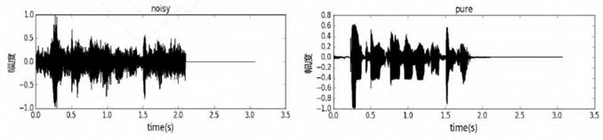
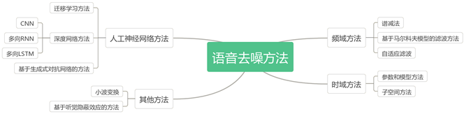

# Problems in speech enhancment

Author: Xin Pan

Data: 2019.07.04

---

## 为什么需要语音增强？

在实际环境中，语音信号总是会受到外界环境噪声的干扰，这些噪声包括从周围环境、传输媒质中引入的噪声、通信设备内部电噪声乃至其他说话人的干扰等等。这些干扰会使接收端的语音成为受噪声污染的语音，当噪声干扰严重时，语音将完全淹没到噪声中，使其无法分辨。

语音增强是解决语音中噪声污染的一种有效方法，它是从带噪语音信号中提取尽可能纯净的原始语音。总的来说语音增强的目标主要有：改进语音质量，消除背景噪声，使听者乐于接受，不感觉疲劳：提高语音可懂度，方便听者理解。但由于噪声来源众多，随着应用场合不同，它们的特性也各不相同。

## 加性噪声（Additive noise）

加性噪声是指独立存在于有用信号，以叠加的形式对信号形成干扰始终干扰有用信号；加性噪声的来源可以分三种：
1.	人为噪声：开关接触噪声
2.	自然噪声：闪电；大气中的电暴
3.	内部噪声：设备系统本身存在的噪声  

在这些噪声中，有的在原理上可以完全或基本消除，但是另一些往往无法避免，而且它们的准确波形不能预测。这种不能预测的噪声就是随机噪声。一般通信中把加性随机性看成是系统的背景噪声。  
## 乘性噪声==信道失配（channel mismatch）==卷积信道效应
卷积信道效应导致不均匀或带宽限制响应，为了去除信道脉冲响应，做信道均衡时对通信信道没有有效建模。一般是由信道不理想引起的，它们与信号的关系是相乘的。在信号时有乘性噪声，没有信号也没有乘性噪声。乘性噪声被看成是系统的时变特性（例如衰落或者多普勒效应或者非线性引起的）。但是非加性噪声可以通过某种变换（如同态滤波）转换成加性噪音。
## 混响（Reverberation）
多径反射引起的叠加效应。收音装置除了接收到声源直接发射的声波外还会接收到声源发出的经过其他途径传递到达的声波。除此之外还有其他声源产生的不需要的声波。  
在声学上将延迟时间大于50ms的反射波称为回声，其他部分叫做混响。

## 现有技术

由于噪声的种类很多，特性并不完全相同，因此针对各类噪声必须采取不同的语音增强方法。一直以来，人们都在加性噪声的模型上进行研究，提出了各种语音增强算法，如图1所示，现有方法可分为四类：第一类是时域方法，例如基于参数和模型的方法、子空间的方法等；第二类是频域方法，例如自适应滤波法，以及基于马尔可夫模型滤波方法等；第三类是人工神经网络方法，例如深度网络方法、生成式对抗网络方法等；第四类是其它方法，例如小波变换法、听觉掩蔽法等。接着针对其中的频域方法和人工神经网络方法简要描述。

图1. 语音增强方法

频域方法利用语音信号的短时谱具有较强的相关性，而噪声的前后相关性很弱的特点，因而短时谱估计的方法从带噪语音中估计原始语音。同时人耳对语音相位感受不敏感，可将估计的对象放在短时谱的幅度上。

人工神经网络方法的热度逐年增加。其中语音增强的GAN也就是将GAN中的随机信号Z和真实的数据X映射到需要增强的语音信号和纯净的语音信号，由GAN的概念，GAN是将随机信号Z服从$P_z(Z)$分布转换成另一种X服从$P_{Data}(X)$分布(也就是真实的数据分布)的模型，所以这里可以把随机信号`Z`当成是含噪语音noisy，真实的数据`X`可以看成是纯净的语音pure voice。

## 参考文献
1. https://blog.csdn.net/miao0967020148/article/details/77991771
2. https://blog.csdn.net/sousky/article/details/89350093
3. https://wenku.baidu.com/view/dc88737830126edb6f1aff00bed5b9f3f90f729b.html
4. https://blog.csdn.net/qq_27217131/article/details/51620274
5. https://blog.csdn.net/yjjat1989/article/details/51119847