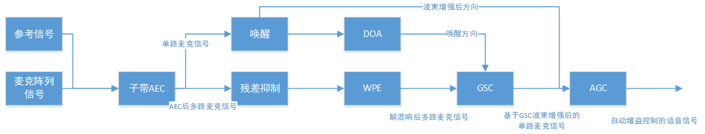
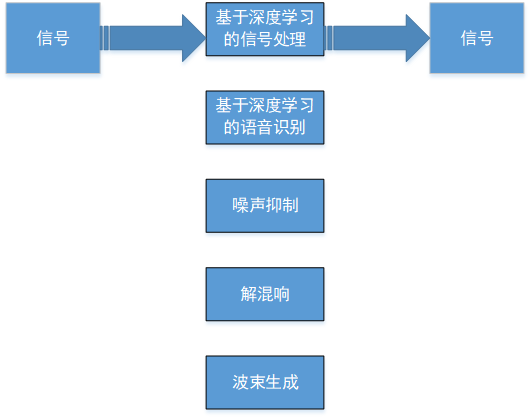
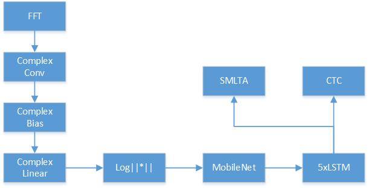
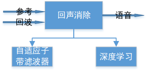
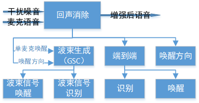

# 远场识别

Author: Xin Pan

Date: 2020.03.26

---

百度提出的《基于复数卷积神经网络的语音增强和声学建模一体化端到端建模技术》。关键词：复卷积网络、端到端、增强和建模一体化。远场识别是明显的一个低信噪比的识别环境，为什么呢？因为目标距离距离收音设备距离远，目标信号衰减严重，再加上环境混响和噪声的干扰将信噪比拉低。收音设备收到的信号中，来自目标的信号叫做目标信号，来自非目标声源的信号称为干扰信号。目标信号和干扰信号的强度比值为信噪比。

## 想解决的问题

远场识别是典型的低信噪比环境下识别场景。因为发音人和收音设备距离远，导致目标信号衰减严重，再加上环境混响和噪声的干扰将信噪比拉低。

## 方法

### Part1 传统技术

传统技术一般包含前端增强模块和后端识别模块。

前端增强模块首先使用到达方向估计（DOA）确定声源的方向，之后使用beamforming（BF）去除波束外的噪音干扰，实际上是通过目标声源的方位信息，增强目标信号，抑制干扰信号。现在也开始使用Neural network（NN）完成BF的工作。

常用的DOA可以分为**基于到达时延的定向算法**和**基于空间谱估计的定向算法**。

常用的BF方法有**基于最小方差无畸变响应波束成形（MVDR BF）**，**线性约束最小方差波束成形（LCMV BF）**和**广义旁瓣消除波束成形（GSC BF）**。通过BF后会产生一路单麦克信号进入后端识别引擎。

后端识别模块就是使用NN进行识别建模。

但是现有的这种方式有一下几个问题：

1. BF在收音域上有缺点即：前端语音增强技术一般使用MSE为优化准则。听觉感知效果好但是识别效果准确率差；
2. 增强目标和识别目标不一致：前端部分和后端识别并不一致，导致前端处理结果在后端并非最优；
3. 真实环境复杂DOA+BF的方案会受到初始DOA结果精度的影响，波动较大。

### Part2 一体化端到端识别

2017年Google提出的采用神经网络进行端到端远场识别问题。他们从Filter-and-sum出发推导出时域模型结构，而后转换到频域，推导出Factored Complex Linear Projection（FCLP）。该方法通过空间滤波和频域滤波，从多通道语音中提取多个方向的特征将结果放入到DNN模型进行识别。这样做实现的是空间滤波和识别的联合优化。

FCLP起源于信号处理的delay-and-sum，使用深度学习去逼近信号波束，因而受到信号处理额先验假设。FCLP的最低层没有挖掘频带之间的相关性信息，存在多路麦克信息使用不充分的问题，影响了深度学习建模过程的模型精度。

### Part3 百度方案

和Part2类似，但是百度完全放弃信号处理方式，采用复数卷积神经网络处理。充分发挥CNN提取特征和多通道数据优势。

使用复数CNN直接对原始的多通道语音信号进行多尺度、多层次的信息抽取，并且挖掘频带间的耦合关联信息。保留原始的相位信息，将抽取特征直接送入到SMLTA中，实现语音到文字的一体化建设。为什么使用复数呢，我觉得进行FFT变换之后使用复数表示，进行CNN计算完成语音和噪声的分离。复数的线性变换是在每个通道上进行的类似于提取听觉敏感特征，就像信号处理中的三角滤波和MFB提取。

贾磊介绍说：“我们的模型能提取生物的信号本质特征，作为对比，Google的系统是假设两路麦克信号对应频带之间的信息产生关系，这没有挖掘频带之间的信息，这也是Google在识别率上偏低的原因。”

## 数据集

Part3 是8000句智能语音音箱采集双路信号。

## 对比组

Part3 使用GSC产生的单路信号训练SMLTA

## 评价指标

人耳听觉感知，识别错误率

## 效果

Part2相比其自己基线系统，相对错误降低16%。Part3相比于传统信号处理方法，将相对错误率降低超过30%

## Reference

[远场语音识别，性能提升 30%，百度怎么做到的？](https://zhuanlan.zhihu.com/p/94256908?utm_source=wechat_session&utm_medium=social&utm_oi=749589831763361792)

## Appendix

### Part1 vs Part2

上图. 回声消除中的差异

| 自适应子带滤波器                                   | 深度学习                                                     |
| -------------------------------------------------- | ------------------------------------------------------------ |
| 音频回路必须是线性的                               | 没有线性回路假设                                             |
| 自适应音频滤波器以人耳感知为目标，不对识别做出帮助 | 基于深度学习的语音增强可以很好处理0dB以上的增强问题          |
| 滤波器收敛需要过程，不能对突发干扰表现出稳定性     | 语音增强和声学识别一体的语音是被可以解决-20dB回波下的识别问题 |

上图. 波束生成差异中的差异

| 基于GSC的波束问题                            | 识别增强一体化端到端模型                         |
| -------------------------------------------- | ------------------------------------------------ |
| 首次唤醒是单麦克信号的唤醒，成功率低         | 首次唤醒可以达到波束唤醒的精度                   |
| 波束唤醒只在第一次和第二次同方向才会有用     | 唤醒后可以在各个精度进行高精度识别               |
| 语音识别必须在波束内，多轮时用户位置容易变化 | 任意方向皆可达到或者超过波束，端到端显著提高精度 |

## Reference

1. [远场语音识别错误率降低30%，百度提基于复数CNN网络的新技术](https://blog.csdn.net/dQCFKyQDXYm3F8rB0/article/details/103415538)